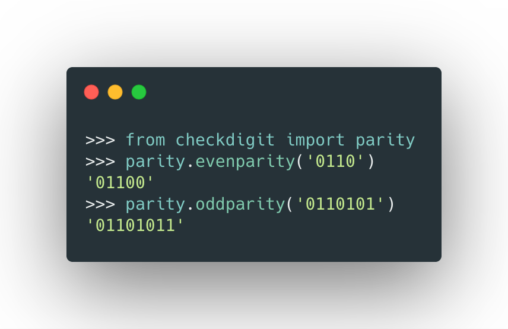
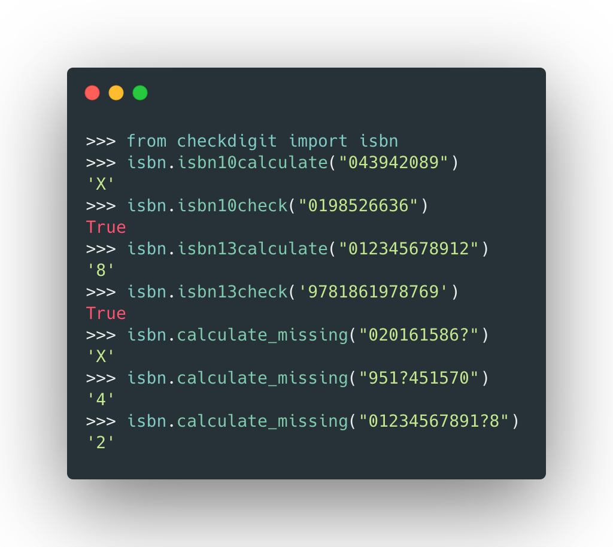
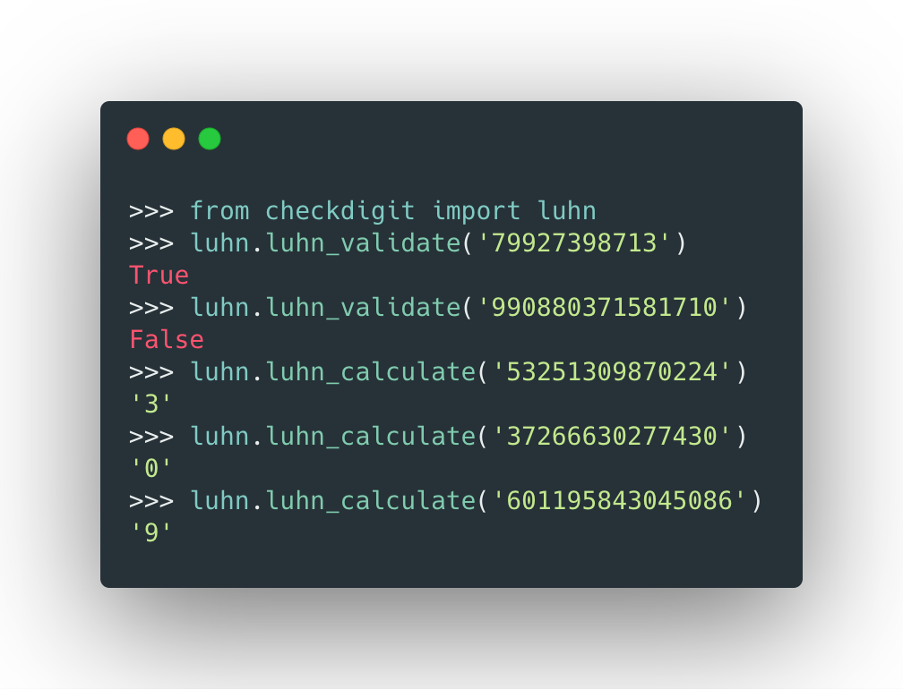

# checkdigit
[](https://travis-ci.com/harens/checkdigit) 
[](https://pypi.org/project/checkdigit/)
[](https://pypi.org/project/checkdigit/)
[](https://pypi.org/project/checkdigit/)
[](https://pypi.org/project/checkdigit/)
<br>
<br>
*Checking digits with a digit!*

 

 

## Installation
```shell
pip install checkdigit
```
Or download the project [here](https://github.com/harens/checkdigit/archive/master.zip)
## Features
- Add a parity digit to a string of binary
- ISBN
    - Validates both ISBN-10 and ISBN-13 Codes
    - Determines Missing Digits
    - Calculates Check Digits
- UPC
    - Evaluates Check Digits
    - Validates UPC Codes
- Luhn
    - Validates Credit Cards, IMEI Numbers, and more!
    - Determines Check Digits


## Tests
The test folder can be found here [here](https://github.com/harens/checkdigit/tree/master/tests)

You can run the tests by running `python tests.py`
## License
This project is licensed under the [GNU General Public License v3.0](https://github.com/harens/checkdigit/blob/master/LICENSE)
